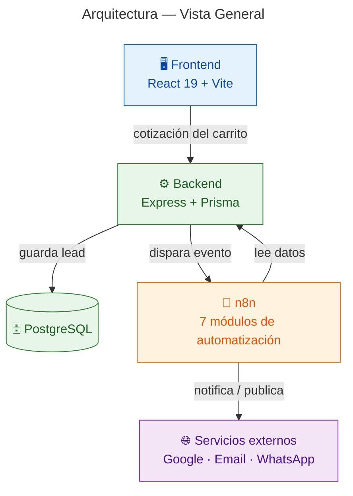
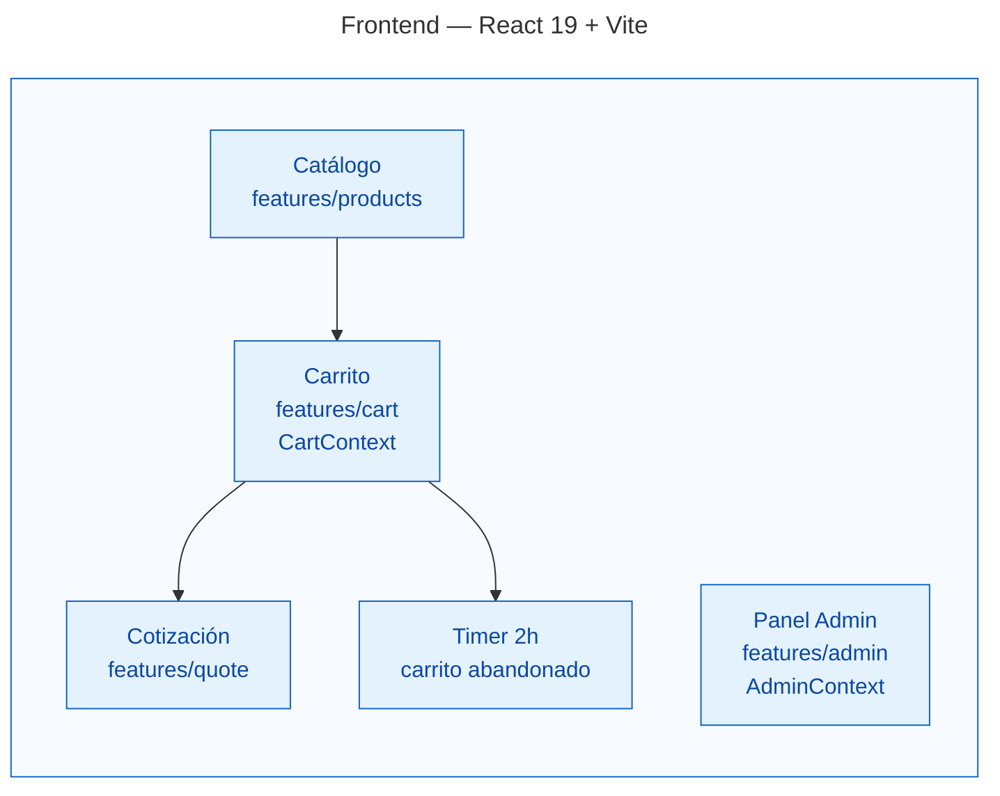
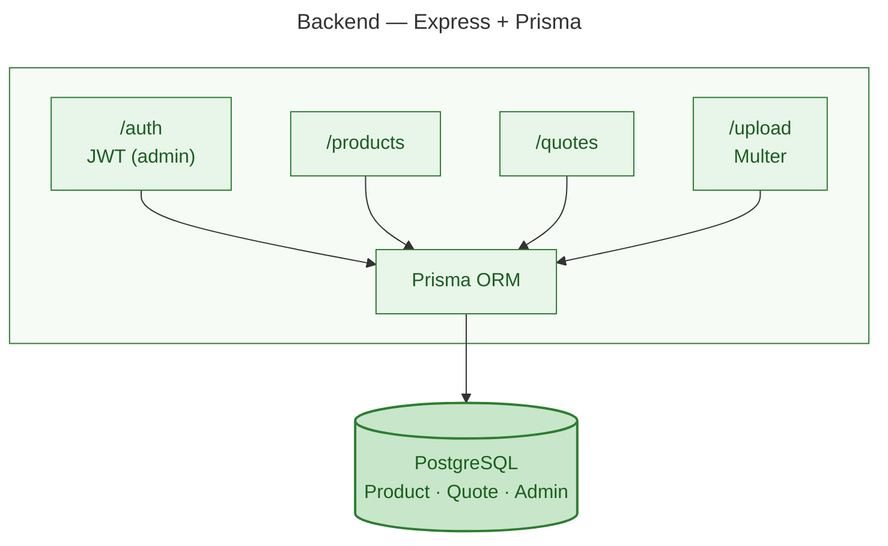
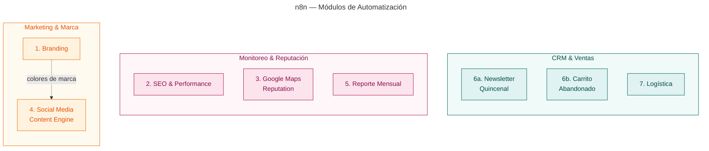
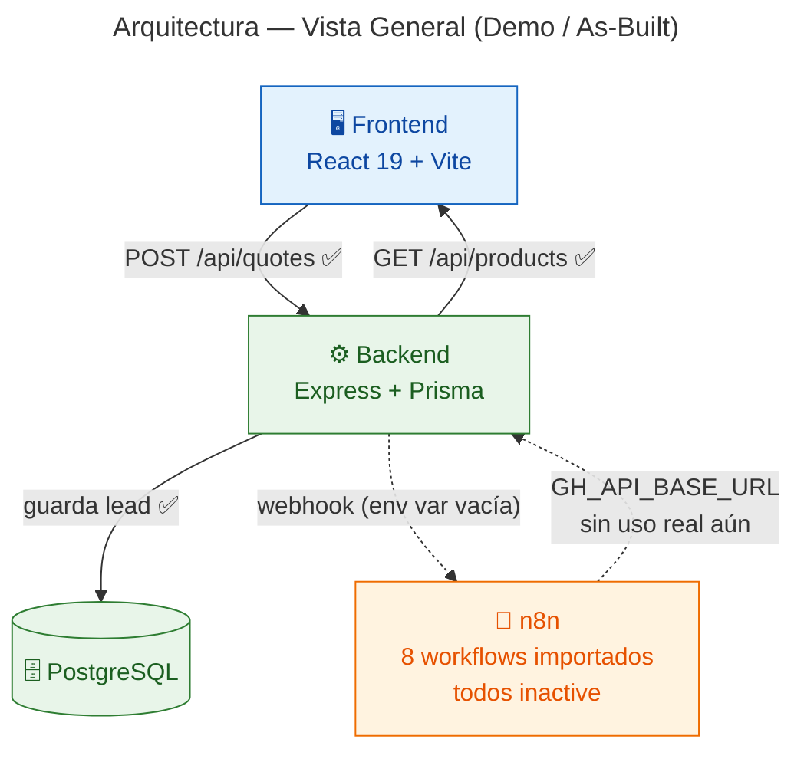
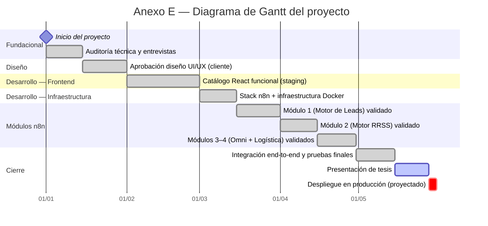

# Diagrama de Arquitectura

Se descompone en varias láminas chicas en vez de un único diagrama grande — así cada una tiene una sola responsabilidad de lectura y el layout automático de Mermaid no termina en cruces de líneas.

- **[0] Overview** — la lámina principal para la tesis: las 3 capas + Postgres + servicios externos, con el flujo lead-to-sale.
- **[1] Frontend** — estructura interna de `src/features/`.
- **[2] Backend** — rutas, modelos y Postgres.
- **[3] n8n** — los 7 módulos agrupados por función de negocio.

Cada set se presenta dos veces: **Arquitectura objetivo** (diseño completo) y **Arquitectura demo / as-built** (lo que corre hoy). Los diagramas de detalle [1]/[2]/[3] no cambian de estructura interna entre ambos — el código es el mismo — así que solo se repiten cuando hay una diferencia real que mostrar; si no, se indica "igual al diagrama objetivo".

Ver también: [`frontend.md`](./frontend.md), [`backend.md`](./backend.md), [`n8n.md`](./n8n.md), [`n8n_workflows.md`](./n8n_workflows.md).

---

## Arquitectura objetivo (diseño completo)

### [0] Overview

### [1] Frontend

*React 19 + TypeScript + Vite. Estructura feature-based bajo `src/features/`. `Timer` corre enteramente en el cliente: si no hay cotización enviada 2h después de actividad en el carrito, dispara el webhook de carrito abandonado.*

### [2] Backend

*Express + TypeScript, validación con Zod en todas las rutas. Única fuente de verdad de datos para frontend y n8n.*

### [3] n8n

| # | Módulo | Trigger | Lee del backend |
|---|---|---|---|
| 1 | Automated Branding | Mensual / webhook | — |
| 2 | SEO & Performance Monitor | Semanal, lunes 08:00 | — |
| 3 | Google Maps Reputation | Cada 6h | — |
| 4 | Social Media Content Engine | Webhook (producto nuevo) | `GET /api/products` |
| 5 | Monthly Activity Report | Día 1 de cada mes | `GET /api/stats/monthly` |
| 6a | Newsletter Quincenal | Quincenal (1º/15) | `GET /api/mock/newsletter-subscribers` |
| 6b | Carrito Abandonado | Webhook (2h inactividad) | `GET /api/stats/abandoned-carts` |
| 7 | Logistics Automation | Webhook (orden confirmada) | `GET /api/orders/:id/items` |

*Docker, SQLite propio en `n8n/data/`, puerto 4343. Única dependencia entre workflows: Branding (1) alimenta colores de marca a Social Media (4).*

---

## Arquitectura demo / tesis (as-built)

Mismo esquema visual que la versión objetivo, para comparar lado a lado. Verificado contra el código real: `backend/src/routes/quotes.ts` (el webhook corta con `if (!url) return` si la env var está vacía) y `docker-compose.yml` (`N8N_QUOTE_WEBHOOK`/`N8N_ABANDONED_WEBHOOK` sin valor por default). Los diagramas [1] Frontend y [2] Backend no difieren estructuralmente del objetivo — mismo código — así que no se repiten; solo cambia el overview y la conexión n8n↔Backend.

### [0] Overview (as-built)

**Leyenda:** línea sólida = implementado y funcionando. Línea punteada = diseñado (código o config presente) pero no activo hoy.

**Gaps identificados** (relevantes para el capítulo de resultados/conclusiones):
- `N8N_QUOTE_WEBHOOK` y `N8N_ABANDONED_WEBHOOK` no están seteados por default en `docker-compose.yml` → el backend nunca dispara hacia n8n en una corrida estándar.
- Ningún workflow de n8n hace `fetch`/`HTTP Request` real contra `GH_API_BASE_URL` todavía, pese a que la infraestructura (`depends_on`, env var) está lista.
- Los 8 workflows están importados en la instancia n8n pero `active: false` — falta activarlos para que corran por schedule/webhook real.

**[1] Frontend** — igual al diagrama objetivo, sin cambios.
**[2] Backend** — igual al diagrama objetivo, sin cambios.
**[3] n8n** — misma agrupación por función de negocio que el objetivo; los 8 workflows existen y están importados en la instancia, pero ninguno está activo (`active: false`) ni hace las llamadas HTTP al backend indicadas en la tabla — ver gaps arriba.

---

## Cronograma del proyecto (Anexo E)

Deriva de la Tabla 3 del cuerpo de la tesis (§3.6, "Hitos principales del proyecto"), que solo documenta **fechas de hito puntuales** (una fecha, un estado). Para el diagrama de Gantt del Anexo E cada fase de trabajo se reconstruye como el intervalo entre un hito y el hito inmediatamente anterior — es la única forma de derivar duraciones reales a partir de una tabla de milestones. Esa inferencia no está en la Tabla 3 original; queda marcada acá para no generar ambigüedad con los datos fuente.

**Cómo leer las barras:** cada tarea corre desde el hito anterior de la Tabla 3 hasta su propia fecha — la duración es **inferida**, no una fecha de inicio declarada en el documento original. Verde/tildado (`done`) = hito con estado "✓ Completado" en la Tabla 3; naranja (`active`) = "En proceso" (Presentación de tesis); rojo (`crit`) = "Pendiente" (Despliegue en producción). El rombo inicial marca el arranque del proyecto (01/01/2026) como punto cero, sin duración.

Render estático para inserción directa en el `.docx` de la tesis: [`../assets/gantt-anexo-e.png`](../assets/gantt-anexo-e.png).
